# Plan de pruebas — Sistema de Préstamo de Equipos Tecnológicos

| Campo           | Detalle                                                                           |
| --------------- | --------------------------------------------------------------------------------- |
| Sprint          | Sprint 1 (14 → 18 de septiembre de 2026)                                          |
| Tipo de pruebas | Manuales, ejecutadas sobre la aplicación de consola                               |
| Responsables    | Juan Polanco, Marlon Sanabria, Michael Martinez (tarea T15)                       |
| Alcance         | Las 8 historias de usuario, con al menos un caso positivo y uno negativo cada una |

## Cómo ejecutar estas pruebas

1. Restaurar los datos semilla: `equipos.json` con EQ-001, EQ-002 y EQ-003 en estado
   *Disponible*, `estudiantes.json` con los dos estudiantes de ejemplo y `prestamos.json` con `[]`.
2. Ejecutar `python main.py` desde `09_Codigo/`.
3. Recorrer cada caso en orden, anotar el **resultado obtenido** tal cual aparece en pantalla y
   marcar el estado.
4. Tomar captura de pantalla de los casos marcados con 📷 — son los que se muestran como
   evidencia en el informe.

**Estados:** **C** Cumple · **F** Falla · **NE** No ejecutado

## Casos de prueba

### HU01 — Registrar equipo

| ID       | Tipo     | Precondición             | Pasos                                                                         | Resultado esperado                                                                                                           | Resultado obtenido                                                            | Estado |
| -------- | -------- | ------------------------ | ----------------------------------------------------------------------------- | ---------------------------------------------------------------------------------------------------------------------------- | ----------------------------------------------------------------------------- | ------ |
| CP-01 📷 | Positivo | Inventario con 3 equipos | Opción 1 → código `EQ-004`, tipo `Portátil`, marca `HP`, modelo `ProBook 440` | Mensaje `[OK] Equipo 'EQ-004' registrado correctamente.`, estado inicial *Disponible*, y el equipo aparece en `equipos.json` | 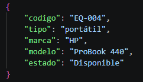                                              | **C**  |
| CP-02    | Negativo | EQ-001 ya existe         | Opción 1 → código `EQ-001` + cualquier dato                                   | Mensaje `[X] Ya existe un equipo registrado con el código 'EQ-001'.` y **no** se crea duplicado                              | Ya existe un equipo registrado con el código 'EQ-001'. (No se creó duplicado) | **C**  |
| CP-03    | Negativo | —                        | Opción 1 → dejar el código vacío y pulsar Enter                               | Mensaje `[X] Este dato no puede quedar vacío.` y el sistema vuelve a pedir el código                                         | Este dato no puede quedar vacio. (El sistema repite hasta rcibir entrada)     | **C**  |
| CP-04    | Negativo | —                        | Opción 1 → código `eq-001` en minúsculas                                      | Se rechaza igual que CP-02: los códigos no distinguen mayúsculas                                                             | Ya existe un equipo registrado con el código 'EQ-001'.                        | **C**  |

### HU02 — Consultar equipos

| ID       | Tipo     | Precondición            | Pasos    | Resultado esperado                                                                         | Resultado obtenido                                                         | Estado |
| -------- | -------- | ----------------------- | -------- | ------------------------------------------------------------------------------------------ | -------------------------------------------------------------------------- | ------ |
| CP-05 📷 | Positivo | 3 equipos disponibles   | Opción 2 | Se listan los 3 con código, tipo, marca, modelo y estado, y al final `Disponibles: 3 de 3` | 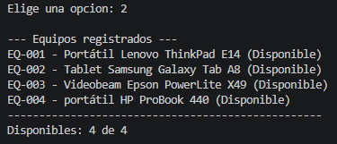                                           | **C**  |
| CP-06    | Positivo | EQ-001 prestado         | Opción 2 | EQ-001 aparece con estado *Prestado* y el conteo baja a `Disponibles: 2 de 3`              | 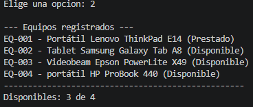                                           | **C**  |
| CP-07    | Borde    | `equipos.json` con `[]` | Opción 2 | Mensaje `[!] Todavía no hy equipos registrados.` en lugar de una lista vacía               | Efectivamente se muestra mensaje que indica que no hay equipos registrados | **C**  |

### HU03 — Registrar estudiante

| ID       | Tipo     | Precondición                   | Pasos                                                                                                | Resultado esperado                                                                                     | Resultado obtenido                                                                                             | Estado |
| -------- | -------- | ------------------------------ | ---------------------------------------------------------------------------------------------------- | ------------------------------------------------------------------------------------------------------ | -------------------------------------------------------------------------------------------------------------- | ------ |
| CP-08 📷 | Positivo | 2 estudiantes registrados      | Opción 3 → `1011223344`, `Carlos Ruiz Vera`, `carlos.ruiz@campuslands.com`, `Desarrollo de Software` | Mensaje `[OK] Estudiante 'Carlos Ruiz Vera' registrado correctamente.` y aparece en `estudiantes.json` | 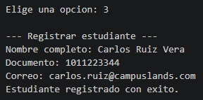 Queda en `estudiantes.json` con id 3. (El sistema no pide programa académico) | **C**  |
| CP-09    | Negativo | Documento 1098765432 ya existe | Opción 3 → documento `1098765432`                                                                    | Mensaje `[X] Ya existe un estudiante registrado con el documento 1098765432.`                          | Ya existe un estudiante con el documento 1098765432. (No se creó duplicado)                                    | **C**  |
| CP-10    | Negativo | —                              | Opción 3 → documento `ABC123`                                                                        | Mensaje `[X] El documento debe contener solo números.`                                                 | El documento debe contener solo numeros.                                                                       | **C**  |
| CP-11    | Negativo | —                              | Opción 3 → correo `correo-invalido`                                                                  | Mensaje `[X] El correo no es válido (ejemplo: nombre@correo.com).`                                     | El correo no tiene un formato valido.                                                                          | **C**  |
| CP-12    | Negativo | —                              | Opción 3 → correo `ana@correo` (sin punto en el dominio)                                             | Se rechaza con el mismo mensaje de CP-11                                                               | El correo no tiene un formato valido.                                                                          | **C**  |

### HU04 — Registrar préstamo

| ID       | Tipo     | Precondición                         | Pasos                                                 | Resultado esperado                                                                             | Resultado obtenido                                                                                                                                                                                                                                  | Estado |
| -------- | -------- | ------------------------------------ | ----------------------------------------------------- | ---------------------------------------------------------------------------------------------- | --------------------------------------------------------------------------------------------------------------------------------------------------------------------------------------------------------------------------------------------------- | ------ |
| CP-13 📷 | Positivo | EQ-001 disponible y Laura registrada | Opción 4 → elegir EQ-001 → elegir a Laura Gómez       | Mensaje `[OK] Préstamo #1 registrado...`, se guarda la fecha de hoy y EQ-001 pasa a *Prestado* | 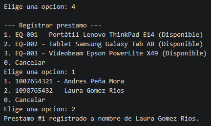                                                                                                                                                                                                                    | **C**  |
| CP-14 📷 | Positivo | Tras CP-13                           | Revisar `datos/equipos.json` y `datos/prestamos.json` | Los **dos** archivos quedan actualizados: el préstamo existe y el equipo dice *Prestado*       | 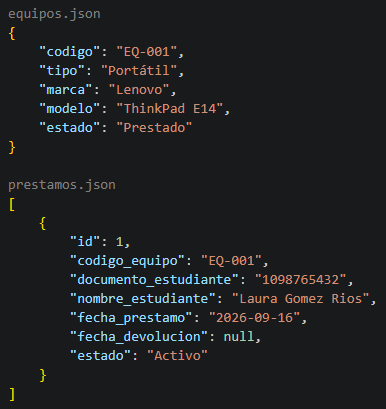                                                                                                                                                                                                                    | **C**  |
| CP-15    | Negativo | EQ-001 ya prestado                   | Opción 4                                              | EQ-001 **no aparece** en la lista de equipos disponibles para elegir                           | Solo aparecen EQ-002 y EQ-003 para elegir                                                                                                                                                                                                           | **C**  |
| CP-16    | Borde    | Todos los equipos prestados          | Opción 4                                              | Mensaje `[!] No hay equipos disponibles para prestar.` y no continúa                           | No hay equipos disponibles para prestar.                                                                                                                                                                                                            | **C**  |
| CP-17    | Borde    | `estudiantes.json` con `[]`          | Opción 4                                              | Mensaje `[!] No hay estudiantes registrados. Registre primero un estudiante.`                  | Primera vez **F**: dejaba elegir el equipo y después decía `No hay estudiantes para mostrar.` Se corrigió `main.py` para revisar los estudiantes antes. Al repetir: `No hay estudiantes registrados. Registra primero un estudiante.` y no continúa | **C**  |
| CP-18    | Positivo | En la lista de equipos               | Opción 4 → escribir `0`                               | La operación se cancela sin registrar nada                                                     | Vuelve al menú y no se registra ningún préstamo                                                                                                                                                                                                     | **C**  |

### HU05 — Registrar devolución

| ID       | Tipo     | Precondición            | Pasos                            | Resultado esperado                                                                  | Resultado obtenido                            | Estado |
| -------- | -------- | ----------------------- | -------------------------------- | ----------------------------------------------------------------------------------- | --------------------------------------------- | ------ |
| CP-19 📷 | Positivo | Préstamo #1 activo      | Opción 5 → elegir el préstamo #1 | Mensaje `[OK] Devolución registrada: el equipo 'EQ-001' vuelve a estar disponible.` | 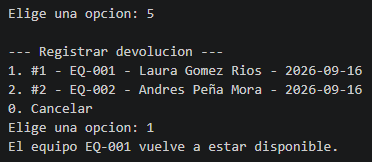             | **C**  |
| CP-20 📷 | Positivo | Tras CP-19              | Opción 2                         | EQ-001 vuelve a aparecer como *Disponible* y el conteo sube                         | 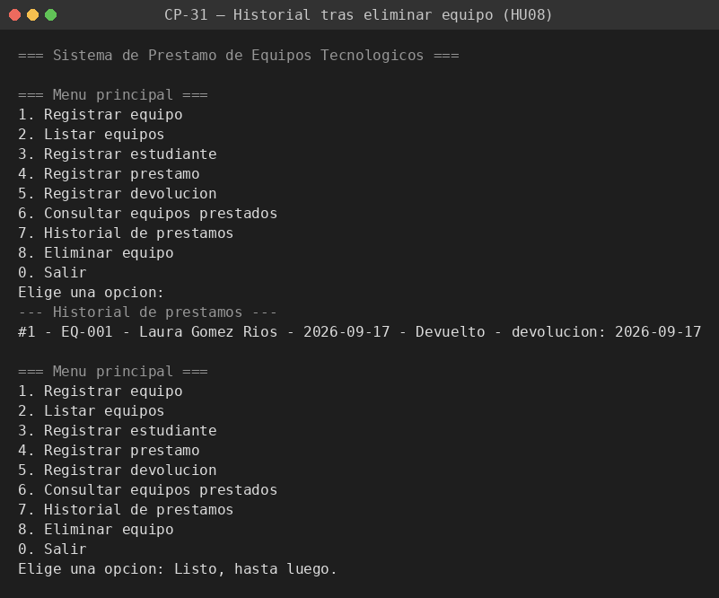             | **C**  |
| CP-21    | Negativo | Préstamo #1 ya devuelto | Opción 5                         | El préstamo #1 **no aparece** en la lista de préstamos activos                      | Solo aparece el préstamo #2, el #1 ya no sale | **C**  |
| CP-22    | Borde    | Sin préstamos activos   | Opción 5                         | Mensaje `[!] No hay préstamos activos por devolver.`                                | No hay prestamos activos.                     | **C**  |

### HU06 — Consultar equipos prestados

| ID       | Tipo     | Precondición               | Pasos    | Resultado esperado                                           | Resultado obtenido | Estado |
| -------- | -------- | -------------------------- | -------- | ------------------------------------------------------------ | ------------------ | ------ |
| CP-23 📷 | Positivo | 1 préstamo activo          | Opción 6 | Se muestra solo ese préstamo, con equipo, estudiante y fecha | [Captura CP-19](Imagenes/11.png)                  | NE     |
| CP-24    | Positivo | Tras devolver ese préstamo | Opción 6 | El préstamo devuelto ya **no** aparece                       |                    | NE     |
| CP-25    | Borde    | Sin préstamos activos      | Opción 6 | Mensaje `[!] No hay préstamos para mostrar.`                 |                    | NE     |

### HU07 — Historial de préstamos

| ID       | Tipo     | Precondición                   | Pasos    | Resultado esperado                                                                    | Resultado obtenido | Estado |
| -------- | -------- | ------------------------------ | -------- | ------------------------------------------------------------------------------------- | ------------------ | ------ |
| CP-26 📷 | Positivo | 1 préstamo activo y 1 devuelto | Opción 7 | Aparecen **los dos**, cada uno con su estado y el devuelto con su fecha de devolución |    [Captura CP-19](Imagenes/13.png)                 | NE     |
| CP-27    | Positivo | Cerrar y reabrir el programa   | Opción 7 | El historial conserva los préstamos de la ejecución anterior                          |                    | NE     |

### HU08 — Eliminar equipo

| ID       | Tipo     | Precondición      | Pasos                                       | Resultado esperado                                                                                          | Resultado obtenido                | Estado |
| -------- | -------- | ----------------- | ------------------------------------------- | ----------------------------------------------------------------------------------------------------------- | --------------------------------- | ------ |
| CP-28 📷 | Negativo | EQ-001 prestado   | Opción 8 → elegir EQ-001 → confirmar `s`    | Mensaje `[X] No se puede eliminar el equipo 'EQ-001' porque está prestado. Registre primero la devolución.` | 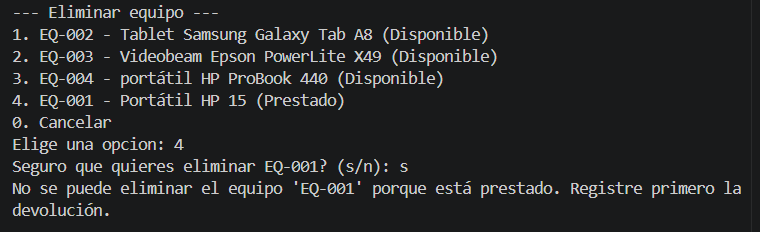  | **C**  |
| CP-29 📷 | Positivo | EQ-001 disponible | Opción 8 → elegir EQ-001 → confirmar `s`    | Mensaje `[OK] Equipo 'EQ-001' eliminado del inventario.` y desaparece del listado                           | 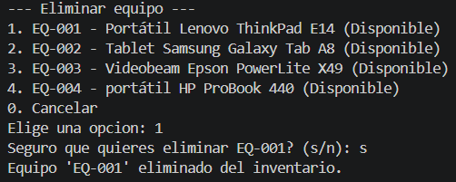  | **C**  |
| CP-30    | Positivo | —                 | Opción 8 → elegir un equipo → responder `n` | Mensaje `[!] Eliminación cancelada.` y el equipo sigue en el inventario                                     | 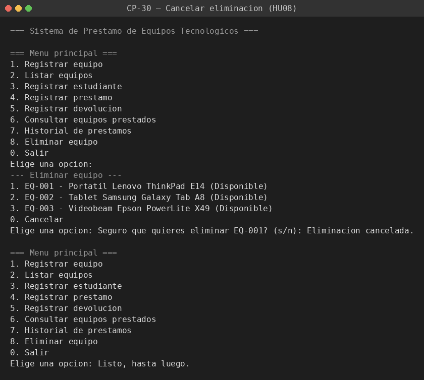 | **C**  |
| CP-31    | Positivo | Tras CP-29        | Opción 7                                    | El historial **conserva** los préstamos del equipo eliminado                                                | 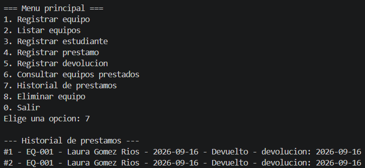 | **C**  |

### Pruebas transversales

| ID    | Tipo  | Precondición                                | Pasos                                                         | Resultado esperado                                                                                                                                                   | Resultado obtenido                | Estado |
| ----- | ----- | ------------------------------------------- | ------------------------------------------------------------- | -------------------------------------------------------------------------------------------------------------------------------------------------------------------- | --------------------------------- | ------ |
| CP-32 | Borde | —                                           | Menú principal → escribir `99`                                | Mensaje `[X] Opción inválida, intente de nuevo.` y el menú vuelve a pedir la opción                                                                                  | 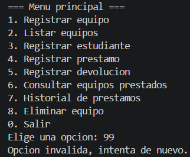 | **C**  |
| CP-33 | Borde | —                                           | Menú principal → escribir `abc`                               | Mismo mensaje que CP-32; el programa no se cae                                                                                                                       | 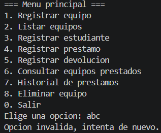 | **C**  |
| CP-34 | Borde | Editar `equipos.json` y dejarlo mal formado | Ejecutar `python main.py`                                     | Mensaje `[X] El archivo ... está corrupto: ...` seguido de `[!] Corrija el archivo antes de volver a ejecutar el programa.` — el programa termina sin traza de error | 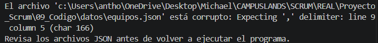 | **C**  |
| CP-35 | Borde | Borrar `datos/prestamos.json`               | Ejecutar `python main.py` → opción 7                          | El programa arranca normalmente tratando la lista como vacía, sin error                                                                                              |  | **C**  |
| CP-36 | Borde | —                                           | Ejecutar `python "ruta/09_Codigo/main.py"` desde otra carpeta | El programa encuentra los JSON igual: las rutas no dependen de dónde se ejecute                                                                                      |       | **C**  |


## Resumen de cobertura

| Historia      | Casos  | Positivos | Negativos / borde |
| ------------- | ------ | --------- | ----------------- |
| HU01          | 4      | 1         | 3                 |
| HU02          | 3      | 2         | 1                 |
| HU03          | 5      | 1         | 4                 |
| HU04          | 6      | 3         | 3                 |
| HU05          | 4      | 2         | 2                 |
| HU06          | 3      | 2         | 1                 |
| HU07          | 2      | 2         | 0                 |
| HU08          | 4      | 3         | 1                 |
| Transversales | 5      | 0         | 5                 |
| **Total**     | **36** | **16**    | **20**            |

## Anexo — Verificación inicial del código (12 de septiembre de 2026)

Antes de arrancar el Sprint se ejecutó una verificación rápida del flujo completo y de los
casos negativos principales, para confirmar que el MVP arranca. **No sustituye la ejecución
formal del plan (tarea T15, viernes 18);** se deja como constancia del estado de partida.

Flujo completo ejecutado desde una carpeta distinta a `09_Codigo/` (equivale a CP-36):
registrar equipo → registrar estudiante → registrar préstamo → listar equipos → consultar
prestados → registrar devolución → listar equipos. Todos los pasos respondieron como se
esperaba y los tres JSON quedaron consistentes.

Salida real de los casos negativos:

```
[X]  Ya existe un equipo registrado con el código 'EQ-001'.
[X]  Ya existe un estudiante registrado con el documento 1098765432.
[X]  El documento debe contener solo números.
[X]  El correo no es válido (ejemplo: nombre@correo.com).
[OK] Préstamo #1 registrado: 'EQ-001' para Laura Gómez Ríos.
[X]  No se puede eliminar el equipo 'EQ-001' porque está prestado. Registre primero la devolución.
[OK] Devolución registrada: el equipo 'EQ-001' vuelve a estar disponible.
[OK] Equipo 'EQ-001' eliminado del inventario.
```

Corresponde a los casos CP-02, CP-09, CP-10, CP-11, CP-13, CP-28, CP-19 y CP-29.


